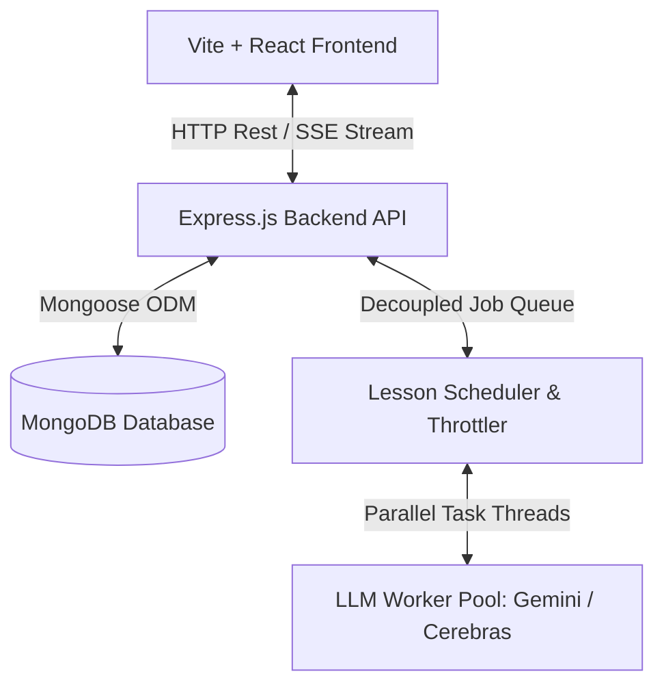
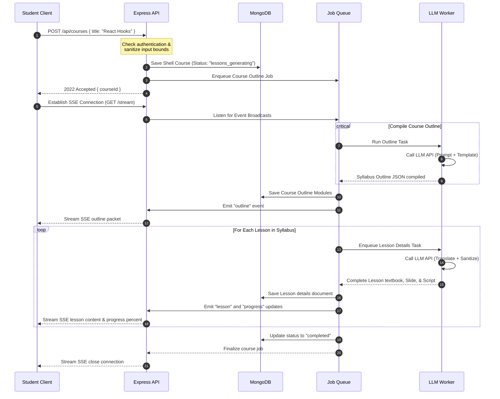
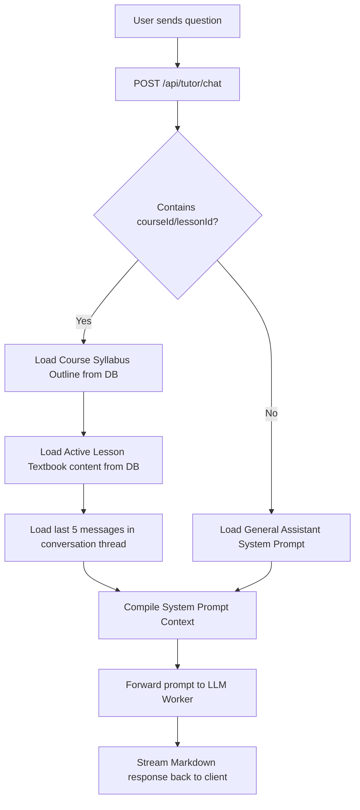

# System Architecture & Workflow Documentation

This document describes the high-level architecture, subsystem boundaries, and sequential process execution flows of GenCourse AI.

---

## 🏛️ System Architecture Overview

GenCourse AI is built on a decoupled, asynchronous multi-tier architecture consisting of three main subsystems:

### 1. Client Layer (Vite + React)
*   State management orchestrated via lightweight, single-directional **Zustand** stores (`useAuthStore`, `useGenerationStore`).
*   Negotiates backend authentication implicitly through secure OIDC redirections and reads telemetry progress streams via `EventSource` listeners.

### 2. Backend API Layer (Express.js)
*   Exposes endpoints for user profile access, library updates, and tutor panels.
*   Enforces secure HttpOnly session authorization states to mitigate cookie/token hijacking.
*   Acts as the central orchestrator for background compiling pipelines.

### 3. Worker Engine Pool (LLM Scheduler)
*   Manages a decoupled, multi-worker concurrency queue.
*   Distributes tasks based on concurrent worker capacity parameters defined in `LLM_WORKERS_CONFIG`.
*   Includes rate-limiting cooldown throttles and fallback switches to route requests to alternate endpoints during failures.

---

## 🔄 Sequence Workflow: Course Generation Pipeline

The diagram below outlines the sequence from initial prompt submission on the frontend to full multi-lingual textbook completion:

---

## 🤖 Sequence Workflow: Context-Aware AI Tutor Chat

The AI Tutor compiles course outlines, reading material context, and chat history before prompting the LLM worker, guaranteeing context-aware answers:

