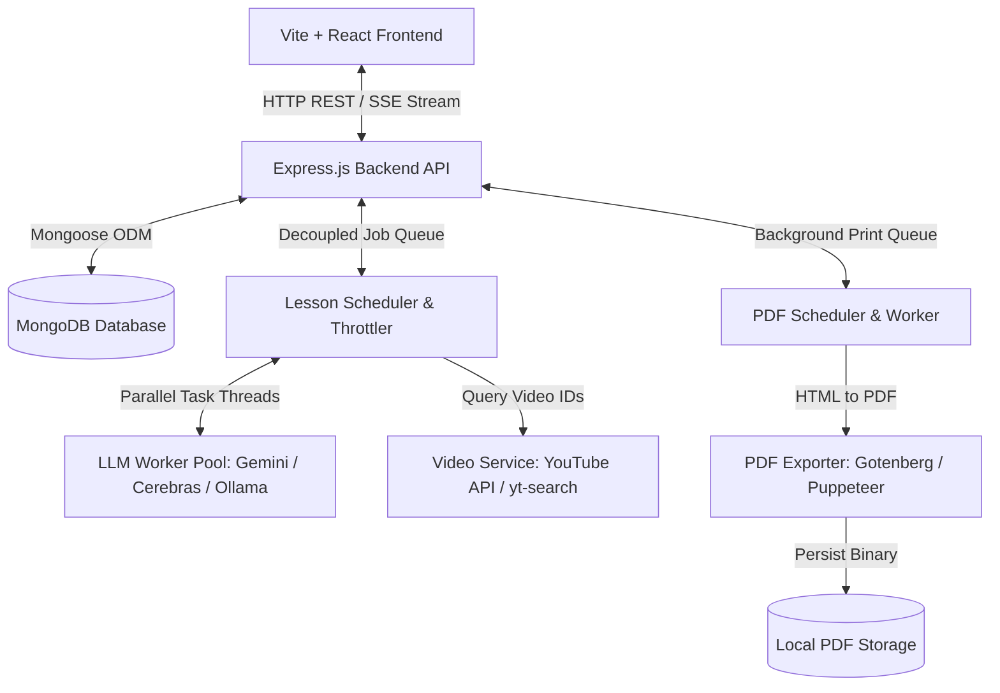
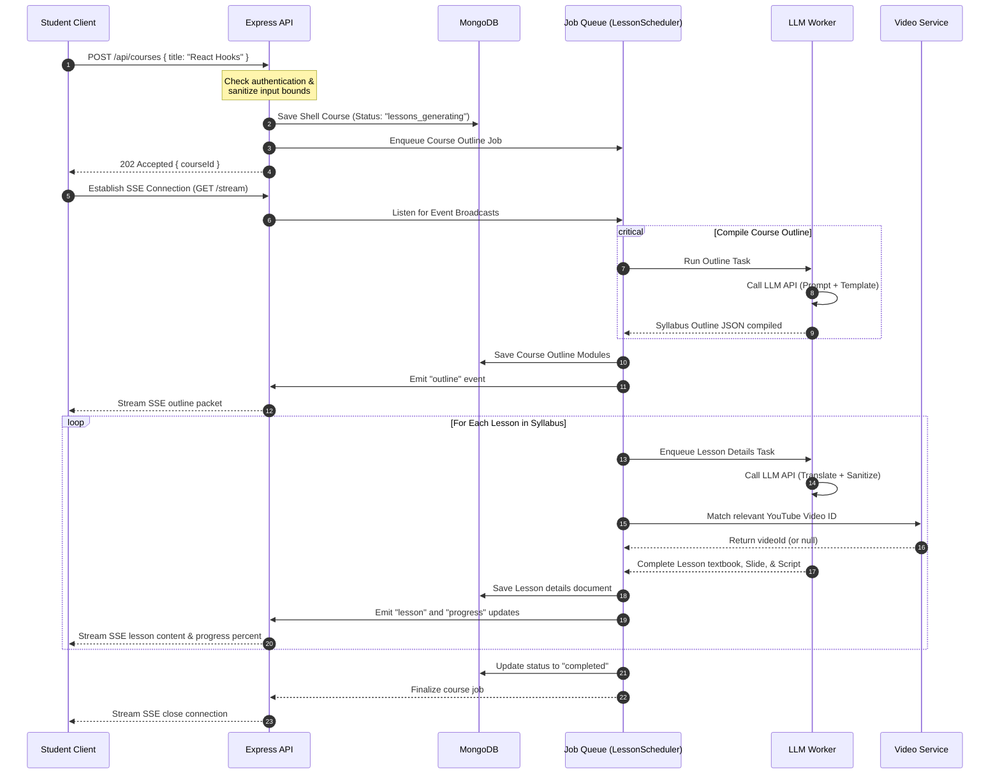
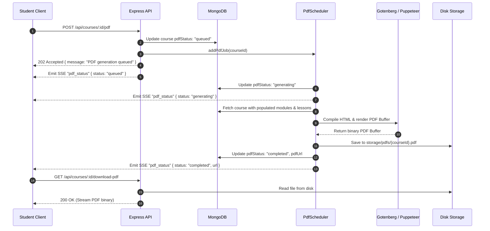
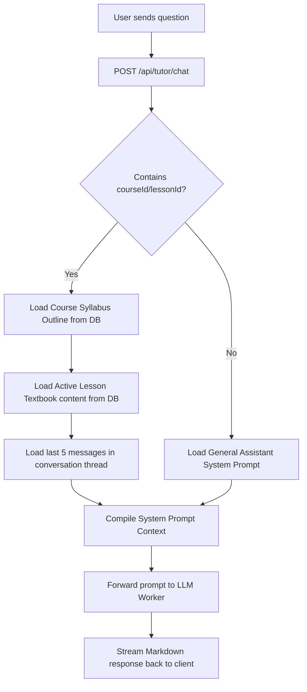

# System Architecture & Workflow Documentation

This document describes the high-level architecture, subsystem boundaries, and sequential process execution flows of GenCourse AI.

---

## 🏛️ System Architecture Overview

GenCourse AI is built on a decoupled, asynchronous multi-tier architecture consisting of dedicated services for syllabus generation, video enrichment, and PDF compilation:

```mermaid
graph TD
  Client[Vite + React Frontend] <-->|HTTP REST / SSE Stream| Server[Express.js Backend API]
  Server <-->|Mongoose ODM| Database[(MongoDB Database)]
  Server <-->|Decoupled Job Queue| LessonScheduler[Lesson Scheduler & Throttler]
  LessonScheduler <-->|Parallel Task Threads| Workers[LLM Worker Pool: Gemini / Cerebras / Ollama]
  LessonScheduler -->|Query Video IDs| VideoService[Video Service: YouTube API / yt-search]
  Server <-->|Background Print Queue| PdfScheduler[PDF Scheduler & Worker]
  PdfScheduler -->|HTML to PDF| Exporter[PDF Exporter: Gotenberg / Puppeteer]
  Exporter -->|Persist Binary| Storage[(Local PDF Storage)]
```

### 1. Client Layer (Vite + React)
*   State management orchestrated via lightweight, single-directional **Zustand** stores (`useAuthStore`, `useGenerationStore`).
*   Negotiates backend authentication implicitly through secure OIDC redirections and reads telemetry progress streams via `EventSource` listeners.

### 2. Backend API Layer (Express.js)
*   Exposes endpoints for user profile access, library updates, lesson progress, PDF generation, and tutor panels.
*   Enforces secure HttpOnly session authorization states with custom signed JWT cookies to mitigate cookie/token hijacking.
*   Acts as the central orchestrator for background compiling pipelines and event emission.

### 3. Worker Engine Pool (LLM Scheduler)
*   Manages a decoupled, multi-worker concurrency queue (`LessonScheduler`).
*   Distributes tasks based on concurrent worker capacity parameters defined in `LLM_WORKERS_CONFIG`.
*   Includes rate-limiting cooldown throttles and fallback switches to route requests to alternate providers during failures.

### 4. Background PDF Compilation Engine (`PdfScheduler`)
*   Manages a dedicated in-memory queue (`PdfJob`) for generating downloadable course textbooks.
*   Processes jobs sequentially to protect server resources and utilizes `PdfExporterFactory` to dynamically bind to **Gotenberg** (headless Chrome microservice) or local **Puppeteer**.
*   Saves compiled PDFs to secure local storage (`backend/storage/pdfs/`) and broadcasts status updates (`queued`, `generating`, `completed`, `failed`) over SSE.

### 5. Video Enrichment Subsystem (`VideoService`)
*   Enriches generated lesson models with contextually relevant video demonstrations.
*   Implements a multi-provider fallback strategy: tries **Google YouTube Data API v3** first, and seamlessly falls back to **`yt-search`** scraping when quota is exhausted or an API key is omitted.

### 6. Student Progress Subsystem (`LessonProgress`)
*   Maintains atomic completion records per user-course-lesson tuple.
*   Calculates dynamic course completion percentages on demand without mutating course curriculum definitions.

---

## 🔄 Sequence Workflow: Course Generation Pipeline

The diagram below outlines the sequence from initial prompt submission on the frontend to full multi-lingual textbook completion:

```mermaid
sequenceDiagram
  autonumber
  participant User as Student Client
  participant Server as Express API
  participant DB as MongoDB
  participant Queue as Job Queue (LessonScheduler)
  participant Worker as LLM Worker
  participant Video as Video Service

  User->>Server: POST /api/courses { title: "React Hooks" }
  Note over Server: Check authentication &<br/>sanitize input bounds
  Server->>DB: Save Shell Course (Status: "lessons_generating")
  Server->>Queue: Enqueue Course Outline Job
  Server-->>User: 202 Accepted { courseId }
  
  User->>Server: Establish SSE Connection (GET /stream)
  Server->>Queue: Listen for Event Broadcasts
  
  critical Compile Course Outline
    Queue->>Worker: Run Outline Task
    Worker->>Worker: Call LLM API (Prompt + Template)
    Worker-->>Queue: Syllabus Outline JSON compiled
  end

  Queue->>DB: Save Course Outline Modules
  Queue->>Server: Emit "outline" event
  Server-->>User: Stream SSE outline packet

  loop For Each Lesson in Syllabus
    Queue->>Worker: Enqueue Lesson Details Task
    Worker->>Worker: Call LLM API (Translate + Sanitize)
    Queue->>Video: Match relevant YouTube Video ID
    Video-->>Queue: Return videoId (or null)
    Worker-->>Queue: Complete Lesson textbook, Slide, & Script
    Queue->>DB: Save Lesson details document
    Queue->>Server: Emit "lesson" and "progress" updates
    Server-->>User: Stream SSE lesson content & progress percent
  end

  Queue->>DB: Update status to "completed"
  Queue-->>Server: Finalize course job
  Server-->>User: Stream SSE close connection
```

---

## 📄 Sequence Workflow: Background PDF Compilation & Download

```mermaid
sequenceDiagram
  autonumber
  participant User as Student Client
  participant Server as Express API
  participant DB as MongoDB
  participant PdfQueue as PdfScheduler
  participant Exporter as Gotenberg / Puppeteer
  participant Storage as Disk Storage

  User->>Server: POST /api/courses/:id/pdf
  Server->>DB: Update course pdfStatus: "queued"
  Server->>PdfQueue: addPdfJob(courseId)
  Server-->>User: 202 Accepted { message: "PDF generation queued" }
  Server-->>User: Emit SSE "pdf_status" { status: "queued" }

  PdfQueue->>DB: Update pdfStatus: "generating"
  PdfQueue-->>User: Emit SSE "pdf_status" { status: "generating" }
  PdfQueue->>DB: Fetch course with populated modules & lessons
  PdfQueue->>Exporter: Compile HTML & render PDF Buffer
  Exporter-->>PdfQueue: Return binary PDF Buffer
  PdfQueue->>Storage: Save to storage/pdfs/{courseId}.pdf
  PdfQueue->>DB: Update pdfStatus: "completed", pdfUrl
  PdfQueue-->>User: Emit SSE "pdf_status" { status: "completed", url }

  User->>Server: GET /api/courses/:id/download-pdf
  Server->>Storage: Read file from disk
  Server-->>User: 200 OK (Stream PDF binary)
```

---

## 🤖 Sequence Workflow: Context-Aware AI Tutor Chat

The AI Tutor compiles course outlines, reading material context, and chat history before prompting the LLM worker, guaranteeing context-aware answers:

```mermaid
flowchart TD
  A[User sends question] --> B[POST /api/tutor/chat]
  B --> C{Contains courseId/lessonId?}
  
  C -->|Yes| D[Load Course Syllabus Outline from DB]
  D --> E[Load Active Lesson Textbook content from DB]
  E --> F[Load last 5 messages in conversation thread]
  F --> G[Compile System Prompt Context]
  
  C -->|No| H[Load General Assistant System Prompt]
  H --> G
  
  G --> I[Forward prompt to LLM Worker]
  I --> J[Stream Markdown response back to client]
```
